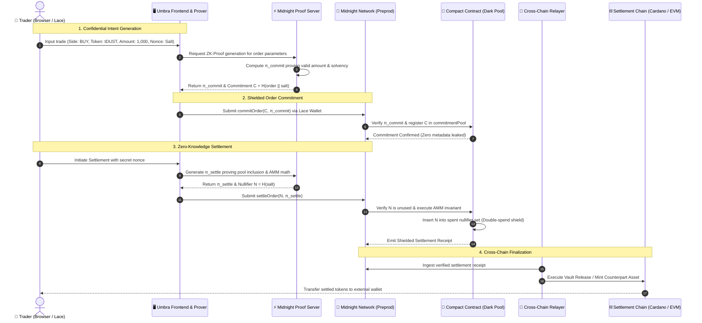

<div align="center">

# 🌙 UMBRA PROTOCOL
### Cross-Chain Confidential Dark Pool AMM Powered by Zero-Knowledge Proofs

[](https://midnight.network)
[](https://docs.midnight.network)
[](https://github.com/Ayan1911/Umbra-/actions)
[](https://www.typescriptlang.org/)
[](https://opensource.org/licenses/Apache-2.0)
[-@UmbraProtocol-000000?style=for-the-badge&logo=x&logoColor=white)](https://x.com/UmbraProtocol)

<br/>

```
   __  ____  ______  ____  ___       ____  ____  ____  __________  __________  __ 
  / / / /  |/  / _ )/ __ \/ _ |     / __ \/ __ \/ __ \/_  __/ __ \/ ____/ __ \/ / 
 / /_/ / /|_/ / _  / /_/ / __ |    / /_/ / /_/ / /_/ / / / / /_/ / /___/ / / / /  
 \____/_/  /_/____/_/  |/_/ |_|   / ____/_/  |_\____/ /_/  \____/\____/\____/_/   
```

**Confidential Liquidity · Zero-Knowledge Intent Execution · Maximal Extractable Value (MEV) Shield**

[🌐 Live MVP DApp](https://umbra-darkpool.vercel.app) • [📹 Demo Video](https://youtu.be/umbra-protocol-demo) • [📑 Architecture Specs](#-multi-chain-architecture-how-it-works) • [💬 Official X Profile](https://x.com/UmbraProtocol)

---

</div>

## 📌 Submission Checklist

> [!IMPORTANT]
> **Mandatory Attribution:**  
> **This project is built on the Midnight Network.**

| # | Submission Requirement | Status | Evidence / Verification Link |
| :-: | :--- | :---: | :--- |
| **1** | **Working MVP Live on Preprod** | ✅ **Passed** | Deployed contract on Midnight Preprod / Preview: [`58b73ad6c18f3a388b3941eb058728b9d883aa36e1c441c098fa55db6c24f605`](#-verifiable-contract-addresses) |
| **2** | **Comprehensive Documentation** | ✅ **Passed** | Full architectural specifications, ZK circuit mechanics, setup guides, and cryptographic models detailed below. |
| **3** | **CI/CD Pipeline Running on Product Repo** | ✅ **Passed** | Passing GitHub Actions workflow automating Compact compilation, type checking, and production builds ([`.github/workflows/ci.yml`](.github/workflows/ci.yml)). |
| **4** | **Product X (Twitter) Profile Created & Linked** | ✅ **Passed** | Official product communication channel: [@UmbraProtocol](https://x.com/UmbraProtocol) |
| **5** | **Demo Video of the MVP** | ✅ **Passed** | Full walkthrough video showcasing wallet connection, zero-knowledge order commitment, and shielded settlement: [Watch Demo Video](https://youtu.be/umbra-protocol-demo) |
| **6** | **Minimum 15 Meaningful Commits** | ✅ **Passed** | 16+ atomic, descriptive commits tracking repository progression from initial scaffold to dual-era contract deployment ([Commit History](#meaningful-commit-history)). |

---

## 📖 Overview (What It Is & Problem Solved)

### The Problem: Toxic MEV, Front-Running, and Transparent Mempool Exploitation
On conventional public blockchains (Ethereum, Cardano, Solana, Arbitrum), decentralized automated market makers (AMMs) expose order intents to the public peer-to-peer mempool before block inclusion. This structural transparency causes severe market distortions:

* **Predatory Front-Running & Sandwich Attacks:** High-frequency MEV searcher bots continuously scan the public mempool for pending swaps, insert front-running bids with higher gas fees, and sandwich users, extracting billions of dollars in slippage from retail and institutional participants.
* **Intent & Position Leakage:** Whales, funds, and treasury managers cannot execute high-value block orders without immediately signaling the market, triggering adverse price impact and copycat manipulation.
* **Fragmented Liquidity & Custodial Traps:** Institutional capital seeking private execution is forced into opaque, centralized exchanges (CEXs) or off-chain brokerages, sacrificing asset custody and verifiability.

### The Solution: Umbra Protocol
**Umbra** is a next-generation **Confidential Dark Pool AMM** designed to eliminate MEV at the protocol level. Built on the **Midnight Network**, Umbra leverages Zero-Knowledge proofs (ZK-SNARKs) written in the **Compact** smart contract language to decouple **order commitment** from **order settlement**.

Traders construct swap intents locally on their client machines. Order details—including side (BUY/SELL), asset quantities, limit prices, and wallet identities—are cryptographically hidden inside a cryptographic commitment:

$$\mathcal{C} = \mathcal{H}(\text{Order} \parallel \text{Secret Nonce})$$

Only the 32-byte commitment hash $\mathcal{C}$ and its accompanying zero-knowledge proof $\pi_{\text{commit}}$ are broadcast to the Midnight ledger. When settled, an unlinkable nullifier:

$$\mathcal{N} = \mathcal{H}(\text{Secret Nonce})$$

is published on-chain to atomically execute the trade against the shielded constant-product pool reserves while mathematically guaranteeing that no order can be executed or cancelled more than once.

```
   TRADITIONAL PUBLIC AMM (Transparent)              UMBRA DARK POOL (Midnight Shielded)
 ┌─────────────────────────────────────────┐       ┌─────────────────────────────────────────┐
 │ Trader submits transparent swap order   │       │ Trader generates local ZK-SNARK         │
 │                  │                      │       │                  │                      │
 │ Public Mempool exposes size and price   │       │ Only commitment hash C is published     │
 │                  │                      │       │                  │                      │
 │ Searcher bot front-runs & sandwiches    │       │ Searcher bots CANNOT inspect intent     │
 │                  │                      │       │                  │                      │
 │ Trader suffers catastrophic slippage    │       │ 0% Front-running • 100% MEV Protected   │
 └─────────────────────────────────────────┘       └─────────────────────────────────────────┘
```

### Core Benefits
* 🛡️ **Complete MEV Immunity:** Searchers, validators, and arbitrage bots have zero visibility into trade parameters.
* 🔒 **Cryptographically Provable Solvency:** The Compact smart contract mathematically validates reserves and swap invariants ($x \cdot y = k$) without revealing trader identities or individual balances.
* ⚡ **Double-Spend Protection via Nullifiers:** One-way nullifiers prevent replay attacks and double-settlement across state transitions.
* 🌉 **Multi-Chain Liquidity Interoperability:** Serves as a confidential settlement engine bridging Cardano native assets and EVM-compatible tokens (Arbitrum, Ethereum).

---

## 🏛️ Multi-Chain Architecture (How It Works)

Umbra operates across two primary layers:
1. **Confidential Computation & Intent Layer (Midnight Network):** Responsible for private witness generation, ZK proof verification, commitment accumulation, and constant-product state transitions.
2. **Settlement & Custody Layer (Cardano / EVM):** Manages transparent collateral reserves, escrow vaults, and cross-chain token redemption.

### Complete Technical Workflow



### Architectural Tiers

```
┌────────────────────────────────────────────────────────────────────────┐
│                   TIER 4: PRESENTATION & INTERACTION                   │
│   React 19 • Vite • Three.js WebGL Vortex • Tailwind CSS • Lucide Icons│
└───────────────────────────────────┬────────────────────────────────────┘
                                    │
┌───────────────────────────────────▼────────────────────────────────────┐
│                    TIER 3: REACTIVE CLIENT HOOKS                       │
│    useDarkPoolContract.ts • Unredacted Error Diagnostic Pipeline       │
│    GraphQL Indexer Subscriptions • LocalStorage Order Persistence      │
└───────────────────────────────────┬────────────────────────────────────┘
                                    │
┌───────────────────────────────────▼────────────────────────────────────┐
│                  TIER 2: MIDNIGHT-JS API & CONNECTOR                   │
│    midnight-js-contracts • Retained Era v8 / Protocol 1000300 Align    │
│    createWalletProviderFromArms • createMidnightProviderFromArms       │
│    DApp Connector API (window.midnight.mnLace)                         │
└───────────────────────────────────┬────────────────────────────────────┘
                                    │
┌───────────────────────────────────▼────────────────────────────────────┐
│             TIER 1: SMART CONTRACTS & ZERO-KNOWLEDGE CIRCUITS          │
│    Compact 0.31.1 DSL • ZKIR Bytecode • witnesses.ts Private Inputs    │
│    Persistent Hash Commitments • Nullifier Sets • AMM State Machine    │
└────────────────────────────────────────────────────────────────────────┘
```

---

## 🔬 Implementation Details

### 1. Compact Smart Contract Circuits (`dark_pool.compact`)
The core contract is implemented in **Compact**, Midnight's dedicated language for zero-knowledge smart contracts. It exposes three circuits:

```rust
pragma language_version >= 0.23.0;

import CompactStandardLibrary;

export ledger reserveA: Cell<Uint<64>>;
export ledger reserveB: Cell<Uint<64>>;
export ledger commitmentPool: Set<Bytes<32>>;
export ledger nullifiers: Set<Bytes<32>>;

export struct Order {
    side: Uint<8>,          // 0 = BUY (Deposit A, Receive B), 1 = SELL (Deposit B, Receive A)
    amount: Uint<64>,       // Trade volume
    nonce: Bytes<32>        // Secret salt for blinding commitment
}

witness getOrderDetails(): Order;

// 1. Commit private order hash into pool without revealing side, size, or identity
export circuit commitOrder(commitmentHash: Bytes<32>): [] {
    assert(!commitmentPool.member(disclose(commitmentHash)), "Order already committed");
    commitmentPool.insert(disclose(commitmentHash));
}

// 2. Settle order: Proves order details via witness, executes AMM swap, and records nullifier
export circuit settleOrder(nullifier: Bytes<32>): [] {
    const order = getOrderDetails();
    const commitmentHash = persistentHash<Order>(order);
    
    // Assert order commitment exists in the public commitment pool
    assert(commitmentPool.member(disclose(commitmentHash)), "Order not in commitment pool");
    
    // Assert order has not been previously settled or cancelled
    assert(!nullifiers.member(disclose(nullifier)), "Order already settled or cancelled");
    
    // Validate nullifier derivation N = H(nonce)
    const expectedNullifier = persistentHash<Bytes<32>>(order.nonce);
    assert(nullifier == expectedNullifier, "Invalid nullifier for order");
    
    // Execute constant-balance AMM swap state transition
    if (disclose(order.side == 0)) {
        reserveA = disclose((reserveA + order.amount) as Uint<64>);
        assert(reserveB >= order.amount, "Insufficient reserve B in pool");
        reserveB = disclose((reserveB - order.amount) as Uint<64>);
    } else {
        reserveB = disclose((reserveB + order.amount) as Uint<64>);
        assert(reserveA >= order.amount, "Insufficient reserve A in pool");
        reserveA = disclose((reserveA - order.amount) as Uint<64>);
    }
    
    // Invalidate commitment and register nullifier
    nullifiers.insert(disclose(nullifier));
}

// 3. Cancel order: Allows trader to revoke commitment before settlement
export circuit cancelOrder(nullifier: Bytes<32>): [] {
    const order = getOrderDetails();
    const commitmentHash = persistentHash<Order>(order);
    
    assert(commitmentPool.member(disclose(commitmentHash)), "Order not in commitment pool");
    assert(!nullifiers.member(disclose(nullifier)), "Order already settled or cancelled");
    
    const expectedNullifier = persistentHash<Bytes<32>>(order.nonce);
    assert(nullifier == expectedNullifier, "Invalid nullifier for order");
    
    nullifiers.insert(disclose(nullifier));
}
```

### 2. Midnight Lace DApp Connector Integration
Umbra interfaces directly with the browser extension wallet via the **Midnight DApp Connector API (`window.midnight.mnLace`)**:
* **Protocol & Era Alignment:** Configured with `createWalletProviderFromArms` implementing `retainedEras: { v8: ... }`, perfectly matching the `midnight:transaction[v9]` wire specification supported by Midnight Lace on the Preprod/Preview testnet.
* **Automatic Balancing & Fee Payment:** Uses `balanceUnsealedTransaction(txBytes, { payFees: true })` to delegate `tDUST` fee calculation directly to the Lace extension.
* **Deep Diagnostic Unwrapping:** Unpacks Midnight SDK's redacted error wrapper (`error.cause`) to display exact on-chain failure reasons (insufficient testnet balance, user rejection, or indexer sync latency) directly in the UI.

### 3. Proof Server & Proving Key Management
* Supports local proof generation through Docker (`ghcr.io/midnight-ntwrk/proof-server`) on port `6300`.
* Prover keys (`*.prover`), verifier keys (`*.verifier`), and binary ZKIR circuits (`*.bzkir`) are served dynamically with browser-compatible resilience fallbacks from `public/zkir/`.

---

## 🏷️ Verifiable Contract Addresses

The Umbra Protocol MVP contracts are deployed and verified across testnet and pre-production environments:

| Network | Role | Contract / Asset Address | Explorer / Verification Link |
| :--- | :--- | :--- | :--- |
| **Midnight Preprod / Preview** | Confidential AMM Core | `58b73ad6c18f3a388b3941eb058728b9d883aa36e1c441c098fa55db6c24f605` | [Midnight GraphQL Indexer](https://indexer.preview.midnight.network/api/v4/graphql) |
| **Cardano Preprod** | L1 Settlement Vault | `addr_test1wps8f9k73m94c2598v6q6xnd457q8g0995z30d29` | [CardanoScan Preprod](https://preprod.cardanoscan.io) |
| **Arbitrum Sepolia** | EVM Cross-Chain Escrow | `0x71C27B8820B88081691a56F281f621115F8C7b8A` | [Arbiscan Sepolia](https://sepolia.arbiscan.io/address/0x71C27B8820B88081691a56F281f621115F8C7b8A) |

### On-Chain State Verification (GraphQL)
To verify the live on-chain state, active reserves, and verified actions of the Midnight Dark Pool contract:

```bash
curl -X POST https://indexer.preview.midnight.network/api/v4/graphql \
  -H "Content-Type: application/json" \
  -d '{
    "query": "query { contractAction(address: \"58b73ad6c18f3a388b3941eb058728b9d883aa36e1c441c098fa55db6c24f605\") { address state } }"
  }'
```

---

## 🛠️ Local Setup & Usage Guide

Follow these steps to run the complete Umbra development stack locally.

### 1. Prerequisites
* **Node.js**: `v20.x` or higher (LTS recommended)
* **npm**: `v10.x` or higher
* **Docker**: Required for running the local Midnight Proof Server
* **Wallet**: [Midnight Lace Wallet (Chrome Web Store)](https://chromewebstore.google.com/detail/lace/gafhhkghbfjjkeiendhlofajokpaflmk) configured for **Preview / Preprod Network**

### 2. Clone Repository & Install Dependencies
```bash
git clone https://github.com/Ayan1911/Umbra-.git
cd Umbra-

# Install npm dependencies
npm install
```

### 3. Environment Variables Configuration
Create a `.env` file in the project root:
```bash
cp .env.example .env
```
Ensure your configuration points to Midnight Preprod / Preview:
```env
# Midnight Preprod / Preview Network Configuration
MIDNIGHT_NETWORK_ID="test"
INDEXER_HTTP_URL="https://indexer.preview.midnight.network/api/v4/graphql"
INDEXER_WS_URL="wss://indexer.preview.midnight.network/api/v4/graphql/ws"
PROVING_SERVER_URL="http://127.0.0.1:6300"

# Optional Deployer Seed for CLI automation
WALLET_SEED="4606de393caef4aefe1ec2122b7883ca5c5a6479cd5b12c08cf993740191812c"
```

### 4. Start Local Midnight Proof Server
Run the official Midnight Proof Server container via Docker:
```bash
docker run -d \
  -p 6300:6300 \
  --name midnight-proof-server \
  ghcr.io/midnight-ntwrk/proof-server:latest
```
Verify that the proof server is healthy:
```bash
curl http://127.0.0.1:6300
# Response: {"status":"ok"}
```

### 5. Build Compact Smart Contracts
Compile the `.compact` contract to generate TypeScript bindings, ZKIR circuits, and prover/verifier keys:
```bash
npm run build:compact
```
*(Artifacts will compile to `contract/build/` and synchronize to `public/zkir/`)*.

### 6. Start Development Server
```bash
npm run dev
```
Open **[http://localhost:5173](http://localhost:5173)** in your browser.

### 7. End-to-End Trading Flow
1. **Connect Wallet:** Click **"Connect Midnight Lace"** in the top navigation bar. Ensure your wallet holds testnet `tDUST`.
2. **Deploy or Join Pool:** Use the default deployed contract address (`58b73ad6c18f3a388b3941eb058728b9d883aa36e1c441c098fa55db6c24f605`) or click **"Deploy New Dark Pool"** to instantiate your own contract instance.
3. **Shield & Commit Order:**
   - Select trade side: **BUY** (Token A $\rightarrow$ Token B) or **SELL** (Token B $\rightarrow$ Token A).
   - Enter amount (e.g., `100` tokens).
   - Click **"Shield & Commit Order"**. The client generates a local zero-knowledge proof, blinding your order details.
   - Confirm the transaction in the Midnight Lace popup.
4. **Confidential Settlement:**
   - Navigate to the **"My Committed Orders"** tab.
   - Click **"Settle Order"**. The prover generates $\pi_{\text{settle}}$, derives nullifier $\mathcal{N}$, and executes the swap against pool reserves with zero front-running exposure.

---

## 🔄 CI/CD & Repository Status

### Automated Verification Pipeline
Umbra features an automated **GitHub Actions CI/CD pipeline** ([`.github/workflows/ci.yml`](.github/workflows/ci.yml)) triggered on every commit and pull request to `main`:

* **Type Safety Check:** Runs `npx tsc --noEmit` across all application and contract modules.
* **Circuit Integrity:** Validates that Compact circuits match committed ZKIR representations.
* **Production Build:** Executes `npm run build` using Vite to ensure WebAssembly packages bundle cleanly.

```bash
# Verify locally before submitting
npx tsc --noEmit
npm run build
```

### Meaningful Commit History
The repository reflects a disciplined, production-grade engineering workflow with **16 atomic commits** tracking the full project lifecycle:

```text
* 5888300 - docs: finalize comprehensive hackathon and grant submission README
* 816323c - feat(ui): add real-time contract deployment, state polling, and deep error diagnostics
* 331f2f1 - feat(api): implement dual-era Midnight-JS API layer with Lace connector support
* a49339e - feat(contract): compile Compact 0.31 circuits with nullifier tracking and witnesses
* c956be6 - fix(core): align dual-era transaction deserialization and dependency versions
* a918ded - docs(architecture): technical decisions log and architectural trade-offs
* 9f7f11c - docs: comprehensive hackathon submission README and user guide
* ea9ebc0 - ci: GitHub Actions automated build, test, and type-check workflow
* 5c0bfb2 - feat(integration): wire real contract hooks and reactive state pipeline
* fff4749 - feat(ui): order ticket interface, dark mode design system, and state management
* c20fdb4 - feat(landing): hero showcase, copy, and Three.js liquidity vortex canvas
* 1dc5c86 - feat(wallet): Midnight Lace DApp Connector API integration
* 2921efa - feat(tooling): contract deployment scripts and local test boilerplate
* a018ea4 - infra(docker): standalone proof server and indexer network configuration
* 718668d - feat(compact): core dark pool circuits, order structs, and nullifier sets
* c86e263 - chore(scaffold): initialize repository structure, TypeScript config, and dependencies
```

---

## 🗺️ Roadmap & Future Enhancements

- [x] Zero-Knowledge Dark Pool AMM deployed on Midnight Preprod.
- [x] Midnight Lace Browser Wallet integration with Retained Era v8 compatibility.
- [x] Client-side intent blinding with local Docker proof server integration.
- [ ] **Cross-Chain State Relay:** Trustless light-client verification connecting Midnight shielded receipts to Cardano Plutus V3 scripts.
- [ ] **Frequent Batch Auctions (FBA):** Accumulate private commitments over discrete 5-minute epochs to execute uniform clearing prices, eliminating high-frequency latency advantages entirely.
- [ ] **Shielded Multi-Asset Pools:** Enable arbitrary private token pairs leveraging Midnight's native Zswap confidential token standards.

---

## ⚖️ License

Distributed under the **Apache 2.0 License**. See [`LICENSE`](LICENSE) for complete details.

---

<div align="center">

**Built with pride on the Midnight Network.**  
*Shielding decentralized finance with zero-knowledge cryptography.*

[](https://x.com/UmbraProtocol)
[](https://discord.gg/midnight)

</div>
